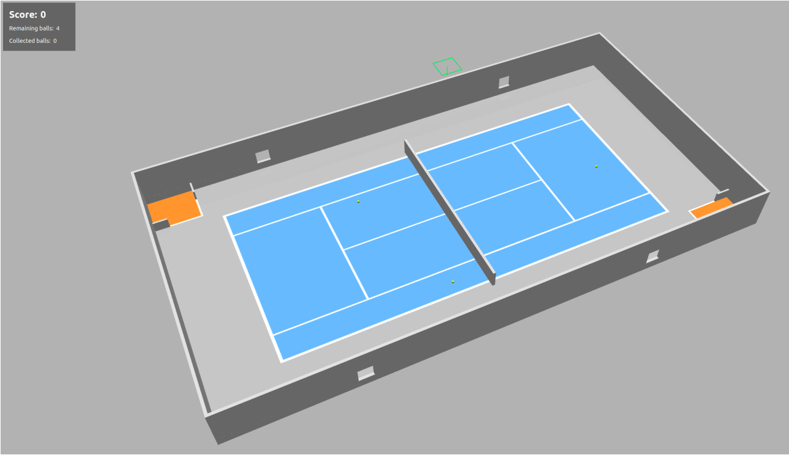

# Tennis Ball Collector

Ceci est le dépôt contenant les sources du projet Tennis Ball Collector, réalisé par le groupe Benoit Pairob dans le cadre du projet d'Ingénierie Système de 3ème année à l'ENSTA Bretagne.

L'application a été réalisée sous [ROS Humble](https://docs.ros.org/en/humble/index.html) (Ubuntu 22.04).

## Objectifs du projet

Le projet consiste à réaliser un robot capable de collecter des balles de tennis sur un terrain de tennis. Le robot doit être capable de se déplacer sur le terrain, de détecter les balles de tennis et de les amener dans la zone de collecte en totale autonomie.


*Terrain de tennis simulé sous Gazebo.*

## Récupérer les sources avec apt

### Télécharger la clé GPG

La clé d'accès au serveur avec notre package est téléchargeable avec la commande suivante :

```bash
git clone https://gitlab.ensta-bretagne.fr/devils_balls_guest/prod-public-key.git
```

### Ajouter la clé GPG au trousseau

Se placer dans le git :

```bash
cd prod-public-key
```

Déplacer la clé :

```bash
sudo cp preprod-public.gpg.key /usr/share/keyrings/
```

Lancer la commande suivante :

```bash
echo "deb [arch=$(dpkg --print-architecture) signed-by=/usr/share/keyrings/preprod-public.gpg.key] http://172.19.48.50:8081/repository/supernana_preprod jammy main" | sudo tee /etc/apt/sources.list.d/benoit.list > /dev/null
```

### Tester la connexion au serveur

Vérifier si on peut télécharger le package :

```bash
sudo apt update 
sudo apt install ros-humble-benoit-pairob ros-humble-vision-pkg ros-humble-custom-msg -y
```

Vous pouvez ensuite passer à la partie suivante pour tester si l'application fonctionne.

## Dépendences

### Vue générale

- **joint_state_publisher**: Un package permettant de publier l'état des joints d'un robot pour la visualisation et la simulation.
- **robot_state_publisher**: Un package utilisé pour diffuser la cinématique d'un robot à partir de fichiers URDF dans le système ROS.
- **robot_localization**: Un package pour la fusion de capteurs et l'estimation de l'état du robot dans le contexte de la navigation robotique.
- **rviz**: Un outil de visualisation 3D interactif pour la visualisation en temps réel de données robotiques, telles que des capteurs, des cartes et des modèles robotiques.
- **xacro**: Un outil permettant de simplifier la création et la gestion des descriptions de robots URDF en utilisant une syntaxe XML simplifiée et extensible.

### Télécharger les dépendences

Commencez par sourcer ROS2 Humble:

```bash
source /opt/ros/humble/setup.bash
```

Ensuite vous pouvez télécharger les dépendances avec ces commandes :

```bash
sudo apt-get install ros-humble-joint-state-publisher
sudo apt-get install ros-humble-robot-state-publisher
sudo apt-get install ros-humble-rviz2
sudo apt-get install ros-humble-xacro
sudo apt-get install ros-humble-joy
```

Ne pas oublier le package tennis_court !

### Démarrer la simulation avec ROS 2

Commencez par build le packages **tennis_court** :

```bash
source /opt/ros/humble/setup.bash
cd ~/ros2_ws/
colcon build
source install/setup.bash
```

Lancez la simulation :

```bash
ros2 launch benoit_pairob display.launch.py
```

Le robot se déplace grâce au joystick de droite de la télécommande :

- Le robot avance/recule si l'utilisateur avance/recule le joystick
- Le robot tourne à gauche/droite si le joystick va vers la gauche/droite

## Groupe

### Membres

- [Clara GONDOT](mailto:clara.gondot@ensta-bretagne.org)
- [Rania ZIANE](mailto:rania.ziane@ensta-bretagne.org)
- [Marguerite MIALLIER](mailto:marguerite.miallier@ensta-bretagne.org)
- [Apolline DEVAULCHIER](mailto:apolline.de_vaulchier@ensta-bretagne.org)
- [Emilie LEDOUSSAL](mailto:emilie.ledoussal@ensta-bretagne.org)
- [Ludovic MUSTIERE](mailto:ludovic.mustiere@ensta-bretagne.org)
- [Titouan BELIER](mailto:titouan.belier@ensta-bretagne.org)

### Gestion de projet

Lien vers notre gestionnaire de projet Agile : [Taïga](https://tree.taiga.io/project/zianerania-benoit_pairob/timeline).

## Structure du dépôt

Le dépôt contient plusieurs dossiers :

- Un dossier 'Debriefing-RDV-Client-Template'
- Un dossier contenant des images
- Un dossier contenant les sources ros2

### Dossier debriefs

Le dossier `Debriefing-RDV-Client-Template` est un dossier contenant les différents compte-rendus de chaque sprint en version odt et en version pdf, disponibles pour le client.

### Dossier ros2_ws/src

Ce dossier contient les multiples packages ROS2 Humble nécessaires au fonctionnement du robot :

- Un package `benoit_pairob`, contenant la simulation et les sources du robot en lui-même comme l'URDF.
- Un package `my_robot_control`, un package pour le contrôle à la télécommande.
- Un package `robot_pkg`, un package pour le contrôle autonome.
- Un package `tennis_court`, contenant le package initial avec la simulation du terrain de tennis.
- Un package `vision_pkg`, contenant les sources relatives à la vision du robot.

### Dossier Images

Le dossier img contient toutes les images que l'on peut montrer au client, ou afficher sur le README.md.

## Détails techniques

- **masse du robot** : 13.6 kg
- **Dimension** : 0.75m x 0.53m x 0.3m
- **Vitesse max** : 1 m/s
- **Coloris** : Rose pastel et gris
