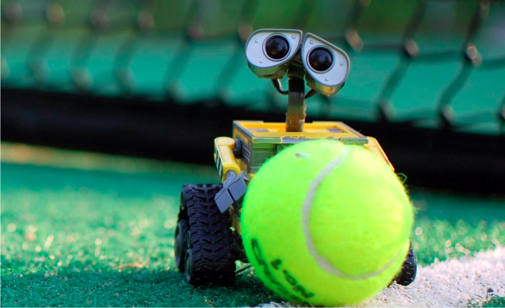

# Robotisation de la collecte de balles de tennis

*Ingénierie Système et Modélisation Robotique (2023-2024)*

### Résumé

En utilisant une méthode de développement agile, votre équipe devra concevoir un robot dédié à la collecte de balles de tennis. 
Ce dernier devra être capable de détecter les balles, les localiser, puis les déplacer jusqu’à une zone de stockage. 
Les spécifications du déroulement du projet sont détaillées ci-après.

## 1. Codes mis à disposition, gitflow et CI/CD

Les codes informatiques devront être hébergés sur un dépôt Gitlab de l'école. Il est recommandé de créer un groupe sous Gitlab pour votre projet (simulateur, documentation, ...).

 * L'environnement de simulation du projet est disponible ici (nous vous conseillons de le _forker_) : [https://gitlab.ensta-bretagne.fr/is-3a/tennis_court](https://gitlab.ensta-bretagne.fr/is-3a/tennis_court)
 * Une proposition de modèle pour la documentation de votre code et des comptes rendus avec le client est disponible ici : [https://gitlab.ensta-bretagne.fr/is-3a/ressources-is](https://gitlab.ensta-bretagne.fr/is-3a/ressources-is)

Il est important de parcourir tout le dépôt et de lire tous les *README* afin de bien comprendre sa structure. 
Complétez les différents *README* en renseignant le nom des contributeurs au développement du projet. 
Vous ajouterez également le lien vers la gestion de projet sous *Taiga*. 

La mise en place d'une architecture CI/CD est obligatoire. Vous préciserez les clés publiques et la procédure pour installer et lancer votre logicielle.

Une méthode de Gitflow doit être utilisée. Pour chaque Sprint, le *Product Owner* sera le seul chargé d'accepter les *Merge Request*. Le nom du *PO* de chaque *Sprint* sera précisé dans votre documentation.

Enfin, des changements effectués sur le dépôt original devront pouvoir être intégrés à votre _fork_ en cours de projet.

## 2. Gestion de projet Agile

La gestion de projet se fera avec la méthode agile _Scrum_ où un sprint correspondra à une journée de développement. 
La gestion de projet se fera sur l’outil web [*Taiga*](https://tree.taiga.io/). L'état d'avancement du projet sera publique.

#### Chaque sprint se déroule comme suit :

- Désignation d’un *Product Owner* en charge de la gestion de projet pour ce sprint
- Spécification des objectifs du sprint, rédiger un rapport en utilisant le fichier *GoalsTemplate.md* comme modèle (nommer ce fichier *XX\_Goals.md*
  où *XX* est le numéro du sprint)
- Création du sprint sous *Taiga*
- Report des fonctionnalités (*User stories*) et des tâches (*Subtasks*) dans le sprint sous *Taiga*
- Développement
- En fin de journée, rédaction d’une revue de sprint en utilisant le modèle *DebriefTemplate.md* (nommer ce fichier *XX\_Debrief.md* où *XX* est le
  numéro du sprint)
- Rendez-vous avec le client [prendre rendez-vous en début de sprint avec le client pour une heure donnée, créneaux de 15min]

A noter que les différents rapports doivent impérativement être envoyés sur le dépôt Git distant à chaque début et fin de sprint, dans le dossier *reports*.

## 3. Objectifs 

L’objectif principal est de concevoir et modéliser un robot dans Gazebo dédié à la collecte de balles de tennis. 
Pour cela, un package ROS de simulation vous est fourni, il comporte les éléments suivants : 

- Un monde Gazebo comportant un court de tennis fermé avec deux zones de stockage marquées par une signalisation au sol de couleur orange et une caméra zénithale 
- Un plugin visuel pour Gazebo affichant le score, le nombre de balles collectées ainsi que le nombre de balles restantes 
- Un script pour la création aléatoire de balles de tennis 

  

  Figure 1: Le monde *court.world* dans Gazebo

Au cours de la simulation 10 balles apparaîtront une par une dans le court, le robot devra alors déplacer chaque balle dans l’une des deux zones de stockage marquées en orange. Les balles doivent rester pendant 5 secondes à l’intérieur d’une zone avant d’être considérées comme collectées. Collecter une balle augmente votre score, la quantité de points gagnée varie en fonction de deux facteurs: 

- Le temps écoulé entre l’apparition de la balle et sa collecte 
- Le temps écoulé entre le début de la simulation et la collecte de la balle 

A noter que les points associés au premier facteur sont plus importants, il est donc préférable de prioriser les balles en fonction de leur ordre d’apparition. 

## 4. Le robot 

La seule contrainte est que vous devez concevoir un robot terrestre à roues. Le mécanisme de collecte des balles ainsi que la stratégie employée sont complètement libres. Tous les capteurs sont autorisés, ainsi que tous les packages ROS 2 que vous jugerez pertinents. Le robot ne doit pas recourir à des capteurs extérieurs à l’exception de la caméra zénithale. La collecte doit être réalisée par une unique instance du robot.
